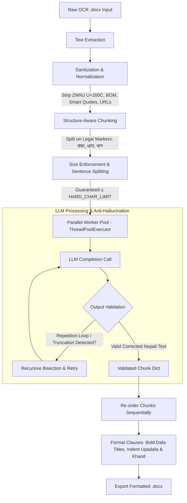

# Nepali Legal OCR Correction Pipeline

[](https://www.python.org/downloads/)
[](LICENSE)
[](https://platform.openai.com)
[](Dockerfile)
[]()

A high-performance, structure-aware pipeline designed to post-process and correct OCR errors in Nepali legal documents (`.docx`) using OpenAI-compatible Large Language Models (e.g., DeepSeek, GPT-4o). It automates scan artifact cleanup, legal hierarchy boundary chunking (दफा / उपदफा / खण्ड), parallelized LLM corrections with anti-hallucination validation, and reassembles perfectly formatted Microsoft Word documents.

---

## 🏗️ Architecture & Pipeline Flow

Correcting Devanagari legal text poses unique challenges: conjunct consonants breakdown, zero-width characters that inflate token consumption, and hallucination loops. This pipeline addresses these issues systematically:



### Key Engineering Features
- **Zero-Width & Artifact Normalization**: Strips Zero-Width Non-Joiner (`\u200c`), ZWSP (`\u200b`), and watermark URLs that trigger tokenizer explosions.
- **Structure-Aware Legal Chunking**: Preserves structural units (भाग, अध्याय, अनुसूची, दफा, धारा, उपदफा, खण्ड) with guaranteed upper character ceilings (`HARD_CHAR_LIMIT`).
- **Anti-Hallucination Guardrails**: Real-time validation checks for consecutive repeated line patterns and suspicious token expansion, recursively bisecting offending chunks.
- **High-Throughput Concurrency**: Multi-threaded request pool with automatic exponential backoff and failed chunk retry passes.
- **Hierarchical DOCX Reassembly**: Auto-formats headings, bold clause labels, and nested indents (0.3" for उपदफा, 0.6" for खण्ड).

---

## 📋 Prerequisites & Installation

### Option A: Containerized Setup (Docker - Recommended)

```bash
# 1. Clone the repository
git clone https://github.com/ajaymahato431/ocr_correction.git
cd ocr_correction

# 2. Configure environment
cp .env.example .env
# Edit .env and enter your DEEPSEEK_API_KEY

# 3. Build Docker image
docker build -t ocr-correction .

# 4. Run batch correction (mount your local data and output folders)
docker run --rm --env-file .env \
  -v "${PWD}/data:/app/data" \
  -v "${PWD}/output:/app/output" \
  ocr-correction --non-interactive
```

---

### Option B: Native Local Installation

#### 1. Python Environment Setup

```bash
# Clone the repository
git clone https://github.com/ajaymahato431/ocr_correction.git
cd ocr_correction

# Create virtual environment
python -m venv venv

# On Linux / macOS:
source venv/bin/activate
# On Windows PowerShell:
.\venv\Scripts\Activate.ps1

# Install dependencies
pip install -r requirements.txt
```

---

## ⚙️ Configuration Guide

1. **Create your `.env` file**:
   ```bash
   cp .env.example .env
   ```

2. **Configure your API keys and provider**:
   ```env
   # Choose default provider: 'deepseek' or 'freemodel'
   DEFAULT_API_PROVIDER=deepseek

   # DeepSeek Settings (Recommended for cost & Nepali speed)
   DEEPSEEK_API_KEY=sk-your-deepseek-api-key-here
   DEEPSEEK_BASE_URL=https://api.deepseek.com
   DEEPSEEK_MODEL=deepseek-v4-flash

   # FreeModel / Custom OpenAI Settings
   FREEMODEL_API_KEY=your_key_here
   FREEMODEL_BASE_URL=https://api.freemodel.dev/v1
   FREEMODEL_MODEL=gpt-4o

   # Concurrency & Chunking
   MAX_WORKERS=5
   MAX_CHUNK_CHARS=1500
   HARD_CHAR_LIMIT=2000
   ```

> **Configuration Precedence**:
> `CLI Arguments` > `Environment Variables (.env)` > `Default Values`

---

## 🚀 Usage & CLI Reference

### Basic Execution (Interactive Mode)
```bash
# Place your .docx files inside the 'data/' directory, then run:
python ocr_correct.py
```
If executed interactively in a terminal without flags, it will prompt you to select the LLM provider.

### Non-Interactive / Automated Batch Execution
```bash
python ocr_correct.py --non-interactive -p deepseek -w 8 -i "data" -o "output"
```

### Full CLI Options Reference

| Option | Env Variable | Default Value | Description |
| :--- | :--- | :--- | :--- |
| `-i`, `--input-dir` | `INPUT_DIR` | `data` | Directory containing uncorrected `.docx` files. |
| `-o`, `--output-dir` | `OUTPUT_DIR` | `output` | Directory where corrected `.docx` files are saved. |
| `-p`, `--provider` | `DEFAULT_API_PROVIDER`| `deepseek` | API provider (`deepseek`, `freemodel`, or custom). |
| `-w`, `--workers` | `MAX_WORKERS` | `5` | Number of concurrent worker threads. |
| `--chunk-size` | `MAX_CHUNK_CHARS` | `1500` | Target character count per semantic chunk. |
| `--hard-limit` | `HARD_CHAR_LIMIT` | `2000` | Hard upper ceiling per chunk before force splitting. |
| `--non-interactive` | — | `False` | Run non-interactively using `.env` or CLI defaults. |
| `-h`, `--help` | — | — | Show help message and exit. |

---

## 🛠️ Diagnostics & Verification Utilities

The repository includes standalone diagnostic tools to inspect problematic documents and analyze chunk sizes before triggering API calls:

### 1. Diagnose Chunks & Character Anomalies (`diagnose_chunks.py`)
Scans a target `.docx` file for abnormal Unicode characters, repeating patterns, and chunk distribution:
```bash
# Analyze a specific document
python diagnose_chunks.py "data/sample_act.docx"

# Auto-detects the first .docx in data/ if no argument is provided
python diagnose_chunks.py
```

### 2. Verify Chunk Sizing & Token Estimates (`verify_chunks.py`)
Calculates token distributions and ensures no chunks exceed context windows:
```bash
python verify_chunks.py "data/sample_act.docx"
```

---

## 🔧 Troubleshooting & FAQ

### Q: `Error: DEEPSEEK_API_KEY not found in environment or .env file`
- **Fix**: Copy `.env.example` to `.env` and verify your API key is correctly entered without extra spaces or quotes.

### Q: `Tokens bloat or context length exceeded`
- **Cause**: Some OCR scanned documents contain corrupted Devanagari Unicode sequences or non-standard fonts that generate excessive BPE tokens.
- **Fix**: The script automatically detects and isolates culprit characters, saving them to `skipped_culprits.txt`. You can also lower `--chunk-size 1000 --hard-limit 1500` for highly corrupted scans.

### Q: `How do I connect a local Ollama or vLLM instance?`
- **Fix**: You can direct `FREEMODEL_BASE_URL` or a custom provider in `.env` to your local endpoint (e.g. `http://localhost:11434/v1`) with any placeholder key.

---

## 📄 License

This project is licensed under the **MIT License**. See the [LICENSE](LICENSE) file for details.
